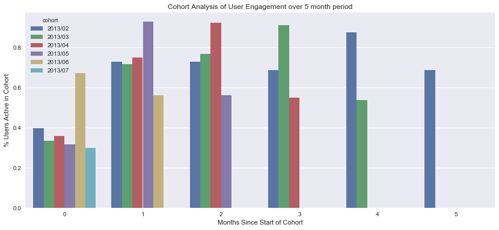
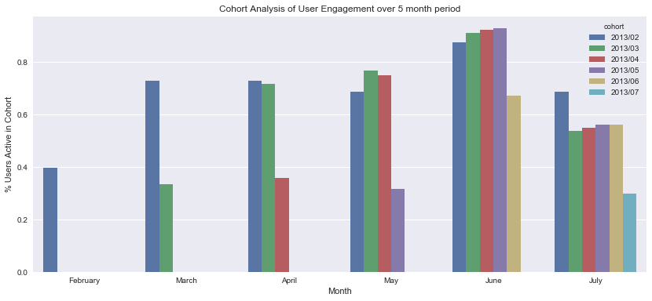

# Cohort Analysis in SQL
**With visualization in Python**

For this mini-project, I started with two datasets. One included users to a fake social media website, and the other included activity (likes, shares, comments) from those users. 

All of the data is included in `dump.sql. `
<br>To create the necessary tables:

```SQL
CREATE TABLE users (id INT(11) PRIMARY KEY NOT NULL, name VARCHAR(40) NOT NULL, date DATETIME NOT NULL);

CREATE TABLE events (id INT(11) PRIMARY KEY NOT NULL, type VARCHAR(15), user_id INT(11) NOT NULL, date DATETIME NOT NULL, FOREIGN KEY (user_id) REFERENCES users(id))
```

The goal of this project was just to gain some familiarity with SQL and cohort analysis. 


```python
import MySQLdb as mdb
import pandas as pd
import matplotlib.pyplot as plt
%matplotlib inline
import seaborn as sns

con = mdb.connect('localhost', 'root', 'password', 'cohortanalysis');
cur = con.cursor();
```

Let's take a look at a sample of the data in the two tables


```python
SQL = '''select * from users limit 5;'''
pd.read_sql(SQL, con=con)
```


<div>
<table border="1" class="dataframe">
  <thead>
    <tr style="text-align: right;">
      <th></th>
      <th>id</th>
      <th>name</th>
      <th>date</th>
    </tr>
  </thead>
  <tbody>
    <tr>
      <th>0</th>
      <td>1</td>
      <td>Miriam</td>
      <td>2013-02-12 10:03:40</td>
    </tr>
    <tr>
      <th>1</th>
      <td>2</td>
      <td>Patricia</td>
      <td>2013-02-12 15:47:37</td>
    </tr>
    <tr>
      <th>2</th>
      <td>3</td>
      <td>Paula</td>
      <td>2013-02-12 17:20:12</td>
    </tr>
    <tr>
      <th>3</th>
      <td>4</td>
      <td>Anita</td>
      <td>2013-02-12 17:33:17</td>
    </tr>
    <tr>
      <th>4</th>
      <td>5</td>
      <td>Herman</td>
      <td>2013-02-14 16:09:33</td>
    </tr>
  </tbody>
</table>
</div>


```python
SQL = '''select * from events limit 5;'''
pd.read_sql(SQL, con=con)
```


<div>
<table border="1" class="dataframe">
  <thead>
    <tr style="text-align: right;">
      <th></th>
      <th>id</th>
      <th>type</th>
      <th>user_id</th>
      <th>date</th>
    </tr>
  </thead>
  <tbody>
    <tr>
      <th>0</th>
      <td>1</td>
      <td>like</td>
      <td>1</td>
      <td>2013-02-10 13:40:03</td>
    </tr>
    <tr>
      <th>1</th>
      <td>2</td>
      <td>like</td>
      <td>1</td>
      <td>2013-02-10 15:35:58</td>
    </tr>
    <tr>
      <th>2</th>
      <td>3</td>
      <td>twitter share</td>
      <td>1</td>
      <td>2013-02-11 16:40:14</td>
    </tr>
    <tr>
      <th>3</th>
      <td>4</td>
      <td>like</td>
      <td>1</td>
      <td>2013-02-12 04:10:14</td>
    </tr>
    <tr>
      <th>4</th>
      <td>5</td>
      <td>twitter share</td>
      <td>4</td>
      <td>2013-02-12 18:12:02</td>
    </tr>
  </tbody>
</table>
</div>


What we would like to do is to:
1. For each month, find the users who signed up during that month. 
2. Track the activity for those users for each successive month. 

Here is the final SQL query I ended up using (developed incrementally):

```SQL
SELECT a.cohort, a.months, a.actives as active_users, t.total_users as total_users, a.actives/t.total_users as percent_active
FROM 
(SELECT DATE_FORMAT(u.date, '%Y/%m') as cohort,
        PERIOD_DIFF(DATE_FORMAT(e.date, '%Y%m'), DATE_FORMAT(u.date, '%Y%m')) as months, 
        COUNT(DISTINCT(u.id)) as actives
FROM users as u
JOIN events as e ON u.id = e.user_id
GROUP BY cohort, months
HAVING months >= 0) as a
JOIN 
(SELECT DATE_FORMAT(gd_month(u.date), '%Y/%m') as cohort,
        COUNT(DISTINCT(u.id)) as total_users
FROM users as u
GROUP BY cohort) as t
ON a.cohort = t.cohort
ORDER BY a.cohort, a.months ASC;
```


```python
SQL = '''SELECT a.cohort, a.months, a.months + RIGHT(a.cohort, 1) - 2 as months_from, a.actives as active_users, t.total_users as total_users, a.actives/t.total_users as percent_active FROM (SELECT DATE_FORMAT(u.date, '%Y/%m') as cohort,        PERIOD_DIFF(DATE_FORMAT(e.date, '%Y%m'), DATE_FORMAT(u.date, '%Y%m')) as months,         COUNT(DISTINCT(u.id)) as actives FROM users as u JOIN events as e ON u.id = e.user_id GROUP BY cohort, months HAVING months >= 0) as a JOIN  (SELECT DATE_FORMAT(gd_month(u.date), '%Y/%m') as cohort,         COUNT(DISTINCT(u.id)) as total_users FROM users as u GROUP BY cohort) as t ON a.cohort = t.cohort ORDER BY a.cohort, a.months ASC;'''


df = pd.read_sql(SQL, con=con)
df['months_from'] = df['months_from'].astype(int)
```

And we have a tabulated version of our cohort analysis. 


```python
df
```


<div>
<table border="1" class="dataframe">
  <thead>
    <tr style="text-align: right;">
      <th></th>
      <th>cohort</th>
      <th>months</th>
      <th>months_from</th>
      <th>active_users</th>
      <th>total_users</th>
      <th>percent_active</th>
    </tr>
  </thead>
  <tbody>
    <tr>
      <th>0</th>
      <td>2013/02</td>
      <td>0</td>
      <td>0</td>
      <td>19</td>
      <td>48</td>
      <td>0.3958</td>
    </tr>
    <tr>
      <th>1</th>
      <td>2013/02</td>
      <td>1</td>
      <td>1</td>
      <td>35</td>
      <td>48</td>
      <td>0.7292</td>
    </tr>
    <tr>
      <th>2</th>
      <td>2013/02</td>
      <td>2</td>
      <td>2</td>
      <td>35</td>
      <td>48</td>
      <td>0.7292</td>
    </tr>
    <tr>
      <th>3</th>
      <td>2013/02</td>
      <td>3</td>
      <td>3</td>
      <td>33</td>
      <td>48</td>
      <td>0.6875</td>
    </tr>
    <tr>
      <th>4</th>
      <td>2013/02</td>
      <td>4</td>
      <td>4</td>
      <td>42</td>
      <td>48</td>
      <td>0.8750</td>
    </tr>
    <tr>
      <th>5</th>
      <td>2013/02</td>
      <td>5</td>
      <td>5</td>
      <td>33</td>
      <td>48</td>
      <td>0.6875</td>
    </tr>
    <tr>
      <th>6</th>
      <td>2013/03</td>
      <td>0</td>
      <td>1</td>
      <td>113</td>
      <td>338</td>
      <td>0.3343</td>
    </tr>
    <tr>
      <th>7</th>
      <td>2013/03</td>
      <td>1</td>
      <td>2</td>
      <td>242</td>
      <td>338</td>
      <td>0.7160</td>
    </tr>
    <tr>
      <th>8</th>
      <td>2013/03</td>
      <td>2</td>
      <td>3</td>
      <td>259</td>
      <td>338</td>
      <td>0.7663</td>
    </tr>
    <tr>
      <th>9</th>
      <td>2013/03</td>
      <td>3</td>
      <td>4</td>
      <td>308</td>
      <td>338</td>
      <td>0.9112</td>
    </tr>
    <tr>
      <th>10</th>
      <td>2013/03</td>
      <td>4</td>
      <td>5</td>
      <td>182</td>
      <td>338</td>
      <td>0.5385</td>
    </tr>
    <tr>
      <th>11</th>
      <td>2013/04</td>
      <td>0</td>
      <td>2</td>
      <td>607</td>
      <td>1699</td>
      <td>0.3573</td>
    </tr>
    <tr>
      <th>12</th>
      <td>2013/04</td>
      <td>1</td>
      <td>3</td>
      <td>1273</td>
      <td>1699</td>
      <td>0.7493</td>
    </tr>
    <tr>
      <th>13</th>
      <td>2013/04</td>
      <td>2</td>
      <td>4</td>
      <td>1566</td>
      <td>1699</td>
      <td>0.9217</td>
    </tr>
    <tr>
      <th>14</th>
      <td>2013/04</td>
      <td>3</td>
      <td>5</td>
      <td>932</td>
      <td>1699</td>
      <td>0.5486</td>
    </tr>
    <tr>
      <th>15</th>
      <td>2013/05</td>
      <td>0</td>
      <td>3</td>
      <td>2410</td>
      <td>7658</td>
      <td>0.3147</td>
    </tr>
    <tr>
      <th>16</th>
      <td>2013/05</td>
      <td>1</td>
      <td>4</td>
      <td>7107</td>
      <td>7658</td>
      <td>0.9280</td>
    </tr>
    <tr>
      <th>17</th>
      <td>2013/05</td>
      <td>2</td>
      <td>5</td>
      <td>4295</td>
      <td>7658</td>
      <td>0.5609</td>
    </tr>
    <tr>
      <th>18</th>
      <td>2013/06</td>
      <td>0</td>
      <td>4</td>
      <td>16635</td>
      <td>24716</td>
      <td>0.6730</td>
    </tr>
    <tr>
      <th>19</th>
      <td>2013/06</td>
      <td>1</td>
      <td>5</td>
      <td>13892</td>
      <td>24716</td>
      <td>0.5621</td>
    </tr>
    <tr>
      <th>20</th>
      <td>2013/07</td>
      <td>0</td>
      <td>5</td>
      <td>6008</td>
      <td>20082</td>
      <td>0.2992</td>
    </tr>
  </tbody>
</table>
</div>


Not much use in tabulated form. Let's visualize it!


```python
fig = plt.figure(figsize=(14, 6))
a = sns.barplot(x='months', y='percent_active', hue='cohort', data=df)
a.set_title('Cohort Analysis of User Engagement over 5 month period')
a.set_xlabel('Months Since Start of Cohort')
a.set_ylabel('% Users Active in Cohort')
fig.savefig('Cohort Analysis of User Engagement, Months since Start.png')
```





<br><br>
**Observations**
<br>
The majority of cohorts experience an increase in activity during the second month of their lifecycle, with the exception of the 2013/06 (June) cohort, which experiences a dip in activity. 

- February cohort experience roughly 5 months of growth before a decline 
- March cohort experiences 4 months of growth before a decline
- The April cohort experiences 3 months of growth before a decline
- The May cohort experiences 2 months of growth before a decline, 
- The June cohort experiences 1 month of growth before a decline 

When we write out the behavior of each cohort, we can see a pattern, but we can't really tell what's going on with this particular visualization. 
<br>
This plot let's us easily compare the relative course activity between cohort, but it does not allow us to easily see how the cohorts perform in terms of absolute time (actual months), only relative time (compared with when the cohort started).
<br><br>Let's take a look at the absolute bar chart to see what's happening there. 


```python
def get_month(x):
    lst = ['February','March','April','May','June','July']
    return lst[x]

df['months_from_feb'] = df['months_from'].apply(get_month)
df.drop('months_from', axis=1, inplace=True)
```


```python
fig = plt.figure(figsize=(14, 6))
a = sns.barplot(x='months_from_feb', y='percent_active', hue='cohort', data=df)
a.set_title('Cohort Analysis of User Engagement over 5 month period')
a.set_xlabel('Month')
a.set_ylabel('% Users Active in Cohort')
fig.savefig('Cohort Analysis of User Engagement, Absolute Months.png')
```





**Observations**
<br>
In this plot it is easier to view the activity of each cohort relative to the month that cohort was active. 
<br><br>
**Conclusions**
<br>
Here it is easy to see that in June, all cohorts have more active users, but in July, all cohorts experience a drop in active users. So the problem isn't something about the length of time of the cohorts, but instead the problem is due to either a change in the product in June, or circumstances external to the product that occurred in June. 


```python

```
